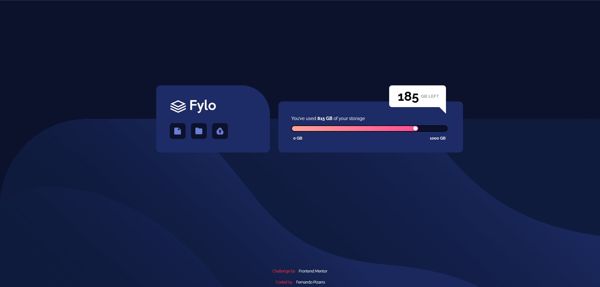

# Frontend Mentor - Fylo data storage component solution

This is my solution to the **Fylo data storage component** challenge on [Frontend Mentor](https://www.frontendmentor.io/challenges/fylo-data-storage-component-1dFOwr6Jx). This component includes some interesting CSS layout and styling details, such as gradients, pseudo-elements, and responsive design.

## Screenshot

## Links

- Live Site URL: [https://fernandopizarrodw.github.io/fylo-data-storage-component](https://fernandopizarrodw.github.io/Fylo-Data-Storage-Component-Fronted-Mentor/)
- Solution on Frontend Mentor: [https://www.frontendmentor.io/solutions/](https://www.frontendmentor.io/solutions/) <!-- (completamos esto luego) -->

## Built with

- Semantic HTML5
- CSS custom properties
- Flexbox
- Responsive layout (mobile first)
- Absolute positioning & pseudo-elements

## What I learned

In this project, I improved my understanding of positioning pseudo-elements to create custom shapes (like the speech bubble tail), gradient backgrounds, and how to position elements both inside and outside of containers using relative/absolute positioning.

## Continued development

I want to keep improving my precision when recreating UI components pixel-perfect, and get more confident using `transform`, `::after`, and `gap` vs `margin` in layout decisions.

## Useful resources

- [CSS Tricks - Pseudo-elements](https://css-tricks.com/pseudo-element-roundup/) – Helped a lot with creating the custom pointer shape.
- [MDN Web Docs - background gradients](https://developer.mozilla.org/en-US/docs/Web/CSS/gradient) – For using linear gradients in the progress bar.

## Author

- GitHub – [@fernandopizarrodw](https://github.com/fernandopizarrodw)
- Frontend Mentor – [@fernandopizarrodw](https://www.frontendmentor.io/profile/fernandopizarrodw)
- LinkedIn – [Fernando Pizarro](https://www.linkedin.com/in/fernandopizarro-dev/)
